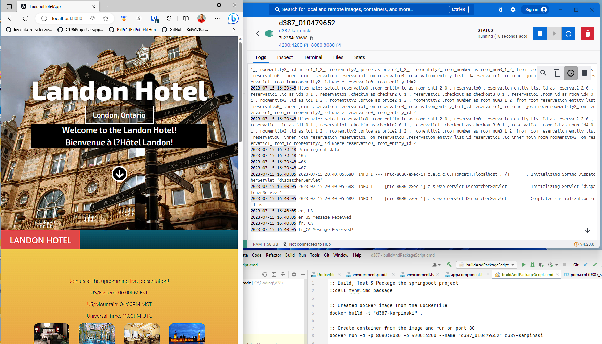

# D387 – ADVANCED JAVA
## Zachary Karpinski

## Git URL (Zach Branch)
https://gitlab.com/wgu-gitlab-environment/student-repos/zkarpi1/d387-advanced-java/-/tree/Zach?ref_type=heads

## Steps and Notes
### C1 Changes
* ReadResource.java NEW FILE: Created class to handle reading the resource file based on the supplied language and country.
* ResourcesController.java NEW FILE: Created class to have the get request from the UI and create two threads to read the EN and FR welcome messages.
* rBundle_en_US.properties NEW FILE: Created en_US localization for the greeting
* rBundle_fr_CA.properties NEW FILE: Created fr_CA localization for the greeting
* app.component.ts Added lines 30, 48-53, 93-97: On page load, the welcome api is call and saved into a list
* app.component.html Added lines 8-10: Display each welcome message as h3
* README.md updated notes.

### C2 Changes
* app.component.html added lines 79-80: Added two new lines for the price in euro and ca$.
* app.component.ts added line 98: Added the Math library.

### C3 Changes
* TimeController NEW FILE: Created class to convert presentation time to 3 timezones and handle the get request.
* app.component.html added lines 29-37: Displayed presentation times in each timezone in the UI
* app.component.ts added lines 31, 55-57, 102-105: Called the get request for presentation times onInit, stored into a string array.

### D2 Changes
* buildAndPackageScript.cmd NEW FILE: Created to simplify building, packaging docker image and create container.
* Dockerfile NEW FILE: Added Docker file used to create docker image
* D387_sample_code-0.0.2-SNAPSHOT.jar Added file: Compiled jar of webapp distrubuted into Docker image
* docker_webapp_evidence.png NEW FILE: Added evidence image.

### D3 Deploying to Cloud
1. To deploy my multithreaded Spring web application to the cloud, I would choose Microsoft Azure as my cloud provider.
2. First I would set up an Azure Container Registry to store my image.
3. Next I would build my image with an appropriate version tag like `latest` and push it to registry.
4. Then I would create an Azure Container Instance using the imaged I pushed to the ACR in step 3.
5. Finally, I would deploy the Azure Container Instance which would make it accessible and live.

